# John-the-Ripper-Practice

A hands-on learning and lab-documentation repo for **John the Ripper (JtR)**, the offline password-cracking tool. This documents my process of learning how JtR works, practicing against deliberately vulnerable/authorized hash sets, and recording screenshots + notes as a cybersecurity portfolio project.

> ⚠️ **Scope & Ethics:** Everything here was run against **hashes I generated myself** or **explicitly authorized practice targets** (e.g. local VMs, CTF platforms like TryHackMe/HackTheBox, or hashes created for this repo). This is a learning log, not a guide for attacking systems you don't own or have permission to test.


## Tools referenced

- [John the Ripper](https://www.openwall.com/john/) (core + Jumbo community edition)
- `hashid` / `hash-identifier` for hash type detection
- `rockyou.txt` and custom wordlists
- `zip2john`, `office2john`, `ssh2john` helper scripts

---

# Table of Contents

1. [What is John the Ripper?](#what-is-john-the-ripper)
2. [Installation](#installation)
3. [Hash Formats](#hash-formats)
4. [Attack Modes](#attack-modes)
5. [Ethics & Scope](#ethics--scope)
6. [Lab 1 — Basic Cracking](#lab-1--basic-cracking-single-crack-mode)
7. [Lab 2 — Wordlist Attacks](#lab-2--wordlist-attacks)
8. [Lab 3 — Rule-Based Mangling](#lab-3--rule-based-mangling)
9. [Lab 4 — ZIP/Office Docs](#lab-4--cracking-protected-zipoffice-files)
10. [Lab 5 — End-to-End Lab](#lab-5--end-to-end-lab-ctf-style)

---

# What is John the Ripper?

John the Ripper (JtR) is an **offline password cracking tool**. Unlike online brute-forcing (hitting a live login form), JtR works against **password hashes** you already have — extracted from a database dump, a Windows SAM file, a Linux `/etc/shadow` file, a password-protected ZIP/Office document, an SSH key, etc.

## How it works, at a high level

1. **You have a hash.** A hash is a one-way transformation of a plaintext password (e.g. `password123` → some fixed-length string). You can't reverse a hash directly.
2. **JtR guesses plaintexts, hashes each guess, and compares.** If the guess's hash matches the target hash, the guess was the original password.
3. **The "guessing strategy" is the attack mode** — this is what makes JtR fast or slow, thorough or shallow.

## Attack modes 

- **Single crack mode** — uses info about the account (username, GECOS fields) to build likely candidate passwords. Fast, good first pass.
- **Wordlist mode** — tries every entry in a wordlist (e.g. `rockyou.txt`), optionally combined with **mangling rules** (appending numbers, leetspeak substitutions, capitalization changes).
- **Incremental mode** — brute-force mode using character-frequency tables; tries all possible character combinations, slow but exhaustive.
- **External mode** — custom cracking logic written in JtR's own mini-language.

## Why this matters for security work

- Understanding JtR shows *why* weak/reused passwords fail, which is directly useful for writing findings in pentest reports.
- Hash cracking speed and feasibility is central to explaining password policy recommendations (length vs. complexity, salting, slow hash functions like bcrypt/argon2).
- It's a standard tool in CTFs and OSCP-style labs.

## Related reading

- Official docs: https://www.openwall.com/john/doc/
- Jumbo (community) fork: https://github.com/openwall/john
-e 
---


# Hash Formats

Before cracking anything, you need to know **what kind of hash you have** — JtR needs the right `--format` (usually it can auto-detect, but ambiguous hashes need help).

## Common formats

| Format flag | Example use case | Notes |
|---|---|---|
| `Raw-MD5` | Old CMS/CTF password dumps | Fast to crack, no salt |
| `Raw-SHA1` / `Raw-SHA256` | Similar to above | Still fast without salting |
| `NT` | Windows password hashes (SAM/NTDS) | Very fast, no salt (legacy) |
| `md5crypt` | Older Linux `/etc/shadow` (`$1$`) | Salted, slower |
| `sha256crypt` / `sha512crypt` | Modern Linux `/etc/shadow` (`$5$`/`$6$`) | Salted, deliberately slow |
| `bcrypt` | Many modern web apps (`$2a$`/`$2b$`) | Salted + tunable cost, slow |
| `zip` | Password-protected ZIP archives | Extracted via `zip2john` |
| `Office` | Password-protected Word/Excel docs | Extracted via `office2john` |
| `ssh` | Encrypted SSH private keys | Extracted via `ssh2john` |

## Identifying an unknown hash

```bash
hashid '<hash-string>'
# or
john --list=formats --format=auto '<hash-string>'
```

Length and prefix are strong hints:
- `32 hex chars` → likely MD5
- `40 hex chars` → likely SHA1
- `64 hex chars` → likely SHA256
- `$1$...` → md5crypt
- `$2a$...` / `$2b$...` → bcrypt
- `$6$...` → sha512crypt

## Extracting hashes from files

```bash
zip2john protected.zip > zip.hash
office2john protected.docx > office.hash
ssh2john id_rsa > ssh.hash
```

Then crack the resulting `.hash` file normally:

```bash
john zip.hash
```


# Attack Modes

## 1. Single crack mode

Uses account-specific info (username, full name/GECOS fields in the hash file) plus light mangling to generate guesses quickly.

```bash
john --single --format=Raw-MD5 hashes.txt
```

Good as a **first pass** — cheap and sometimes surprisingly effective against personalized passwords (`john123`, `John2024!`).

## 2. Wordlist mode

Tries every line of a wordlist as a candidate password.

```bash
john --wordlist=/usr/share/wordlists/rockyou.txt --format=Raw-MD5 hashes.txt
```

Add mangling rules to multiply coverage (e.g. try `password`, `Password`, `password1`, `p@ssword`, etc from a single wordlist entry):

```bash
john --wordlist=rockyou.txt --rules --format=Raw-MD5 hashes.txt
```

## 3. Incremental (brute-force) mode

Tries all character combinations up to a length, ordered by character-frequency likelihood. Exhaustive but slow — realistic only for short/low-entropy passwords.

```bash
john --incremental --format=Raw-MD5 hashes.txt
```

## 4. Showing cracked results

Cracked passwords are cached in `~/.john/john.pot`, not printed live by default in some modes:

```bash
john --show hashes.txt
```

## 5. Restoring an interrupted session

```bash
john --restore
```

## Choosing an approach

1. `--single` first (fast, cheap).
2. `--wordlist` + `--rules` next (covers most real-world weak passwords).
3. `--incremental` only for short hashes or when time budget allows.


# Ethics & Scope

This repo is a **learning log**, not an attack toolkit aimed at real targets.

## What's in scope

- Hashes I generate myself for practice (e.g. `echo -n "test" | md5sum`)
- Deliberately vulnerable CTF platforms (TryHackMe, HackTheBox, VulnHub) where password cracking is part of the intended challenge
- Local VMs and files I own and control
- Publicly available practice wordlists/hash sets designed for learning (e.g. rockyou.txt, which is itself a leaked-and-published dataset widely used for education)

## What's out of scope

- Any hash, account, or system I do not own or do not have explicit written authorization to test
- Real user credentials from any live system
- Anything that would violate a platform's terms of service or local law

## Why document this at all

Understanding how quickly weak/reused passwords fall to cracking tools is foundational to:
- Writing credible pentest findings and remediation advice
- Explaining *why* password policies (length, salting, slow hashing like bcrypt/argon2) matter
- General blue-team password-hygiene guidance

If you're reading this as a recruiter/reviewer: every screenshot in this repo comes from a self-hosted or explicitly authorized practice environment.
-e 
---

# Lab 1 — Basic Cracking (Single Crack Mode)

**Goal:** Generate a simple hash myself and crack it with `--single` mode to confirm JtR is installed and working end-to-end.

## Setup

```bash
# Generate a sample MD5 hash of a known password for practice
echo -n "bibek123" | md5sum
```

Save the output into a file in JtR's expected `user:hash` format, e.g. `hashes.txt`:

```
testuser:5f4dcc3b5aa765d61d8327deb882cf99
```

*(Screenshot:)*

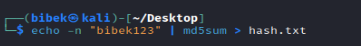

## Cracking

```bash
john --format=Raw-MD5 hashes.txt
```

*(Screenshot: )*

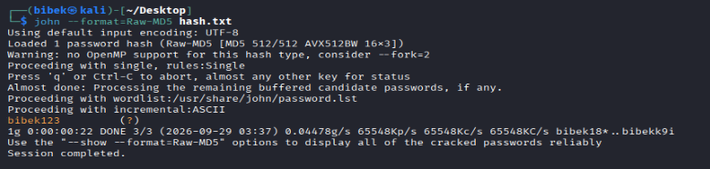

## Verifying

```bash
john --show --format=Raw-MD5 hashes.txt
```

*(Screenshot: )*
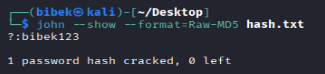

## Notes / lessons learned

- _Fill in after running: how long did it take, anything unexpected, format quirks._
-e 
---

# Lab 2 — Wordlist Attacks

**Goal:** Crack a small set of self-generated hashes using `rockyou.txt` (or a custom wordlist) to see how far common-password coverage goes.

## Setup

Create several hashes from common/weak passwords for practice:

```bash
for pw in password123 letmein qwerty2024 iloveyou; do
  echo -n "$pw" | md5sum
done
```

Compile into `hashes2.txt` in `user:hash` format.

*(Screenshot:)*

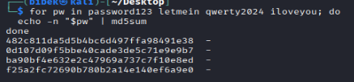

## Locate/decompress rockyou.txt (Kali default location)

```bash
ls /usr/share/wordlists/
sudo gunzip /usr/share/wordlists/rockyou.txt.gz   # if still gzipped
```

## Run wordlist attack

```bash
john --wordlist=/usr/share/wordlists/rockyou.txt --format=Raw-MD5 hashes2.txt
```

*(Screenshot:)*

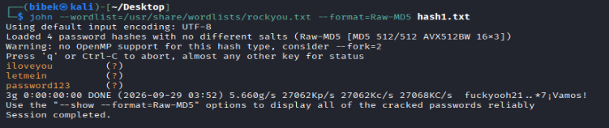

## Results

```bash
john --show --format=Raw-MD5 hashes2.txt
```

*(Screenshot:)*

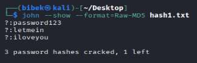

## Notes / lessons learned

- _Fill in: crack time, which passwords fell fastest, any that survived and why._
-e 
---

# Lab 3 — Rule-Based Mangling

**Goal:** Show how mangling rules extend a small wordlist to catch "slightly modified" passwords (e.g. `password` → `Password1!`).

## Setup

Create a tiny custom wordlist of base words:

```bash
cat > base-words.txt << 'EOF'
password
welcome
dragon
football
EOF
```

Generate hashes for mangled variants a person might actually pick (e.g. `Password1!`, `Welcome2024`) and save to `hashes3.txt`.

*(Screenshot: )*

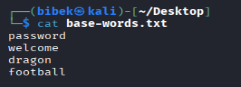

## Run without rules (baseline — expect failures)

```bash
john --wordlist=base-words.txt --format=Raw-MD5 hashes3.txt
```

*(Screenshot:)*

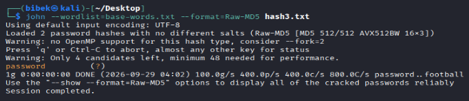

## Run with rules enabled

```bash
john --wordlist=base-words.txt --rules --format=Raw-MD5 hashes3.txt
```

*(Screenshot:)*

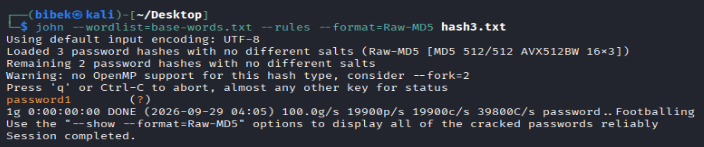

## Notes / lessons learned

- _Fill in: how many additional passwords the rules caught, which rule variants mattered (capitalization, appended digits/symbols)._
-e 
---

# Lab 4 — Cracking Protected ZIP/Office Files

**Goal:** Practice the "extract hash from a file, then crack" workflow used for real-world encrypted files.

## Setup — create a password-protected ZIP for practice

```bash
echo "practice content" > secret.txt
zip --password practice123 protected.zip secret.txt
```

## Extract the hash

```bash
zip2john protected.zip > zip.hash
cat zip.hash
```

*(Screenshot: )*

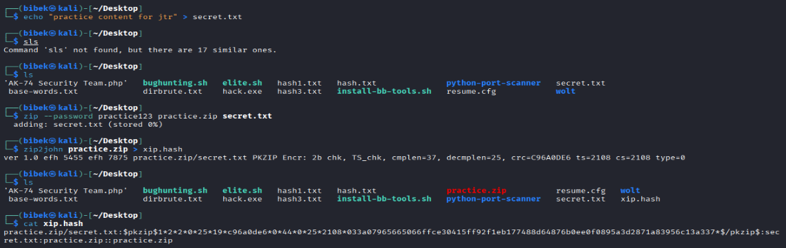

## Crack it

```bash
john --wordlist=/usr/share/wordlists/rockyou.txt zip.hash
```

*(Screenshot:)*

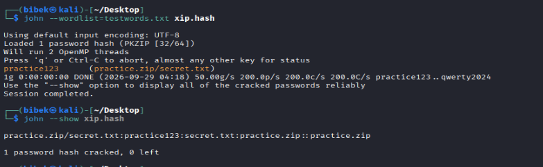

## Repeat for a protected Office document (optional)

```bash
office2john protected.docx > office.hash
john --wordlist=/usr/share/wordlists/rockyou.txt office.hash
```

*(Screenshot: )*


## Notes / lessons learned

- _Fill in: any format-detection issues, crack time differences between ZIP and Office encryption._
-e 
---

# Lab 5 — End-to-End Lab (CTF-style)

**Goal:** Tie everything together in a single walkthrough against a realistic scenario — e.g. a TryHackMe/HackTheBox room that involves extracting and cracking hashes, or a self-built VM with a dumped `/etc/shadow`.

*(Fill this in once a specific lab/room is chosen — suggested candidates: TryHackMe "Crack the Hash", "John the Ripper" room, or a VulnHub box with a shadow dump.)*

## Scenario

- **Platform / box name:** _TBD_
- **Objective:** _TBD_
- **Authorization:** _confirm this is an authorized practice platform before starting_

## Recon — finding the hash(es)

```bash
# e.g. dumped /etc/shadow, extracted DB creds, etc.
```

*(Screenshot)*


## Identifying the hash format

```bash
hashid '<hash>'
```

*(Screenshot)*


## Cracking

```bash
john --wordlist=/usr/share/wordlists/rockyou.txt --format=<detected-format> target.hash
```

*(Screenshot)*


## Result & write-up

- **Cracked password:** _TBD_
- **Time to crack:** _TBD_
- **Why it was crackable:** _weak/reused/dictionary word/etc._
- **Recommendation:** _what the target should have done differently (length, salting, MFA, slow hash algorithm, etc.)_

*(Screenshot: final proof/flag)*

-e 
---

